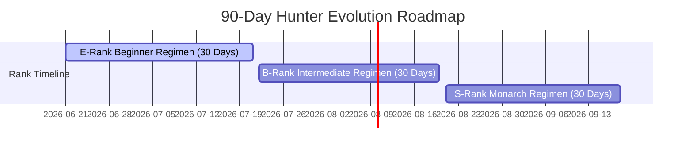

# 🌌 HUNTER SYSTEM : SHADOW MONARCH REGIMEN
> **"Arise."** — The ultimate fitness progression system inspired by Solo Leveling.


---

## ⚡ SYSTEM STATUS HUD
| ATTRIBUTE | SPECIFICATION |
| :--- | :--- |
| **SYSTEM ENGINE** | React 19 + TypeScript + Vite |
| **STYLING LAYER** | Tailored Vanilla CSS HUD Grid |
| **DATABASE COMPLIANCE** | MongoDB Atlas Synchronized |
| **DECIBEL ENGINE** | Web Audio API Synthetic Oscillators |
| **TIMELINE SCHEMA** | 90-Day Hunter Transcendence Progression |

---Update only the 90-Day Hunter Transformation Timeline cards.

Do not create new page.
Do not redesign existing UI.
Do not change layout.

Add posture mobility exercises inside each rank card.

E Rank (Day 1-30):
Current:
Pushups: 30
Squats: 50
Walking: 8000 Steps
Plank: 3 Minutes
Meditation: 10 Minutes

Add:
Hanging: 3 x 30 seconds
Cobra Stretch: 3 x 30 seconds
Cat-Cow Stretch: 2 Minutes
Wall Posture Hold: 3 Minutes


B Rank (Day 31-60):
Current:
Pushups: 60
Squats: 80
Walking: 10000 Steps
Plank: 5 Minutes
Meditation: 15 Minutes

Add:
Hanging: 4 x 30 seconds
Cobra Stretch: 4 x 30 seconds
Cat-Cow Stretch: 3 Minutes
Wall Posture Hold: 5 Minutes


S Rank (Day 61-90):
Current:
Pushups: 100
Squats: 100
Running: 5 KM
Plank: 10 Minutes
Meditation: 20 Minutes

Add:
Hanging: 5 x 30 seconds
Cobra Stretch: 5 x 30 seconds
Cat-Cow Stretch: 5 Minutes
Wall Posture Hold: 5 Minutes


Purpose:
Improve posture, mobility and flexibility.

Do not mention guaranteed height increase.

Use existing XP system and MongoDB Atlas data saving.

Keep same Hunter System design.

## 🔮 THE COGNITIVE INTERFACE (UI)

The UI is designed to mimic the holographic dashboard of the **Solo Leveling** system:
- **Futuristic HUD Panel**: Complete with glassmorphic panels, glowing cyber blue border accents, and dynamic game-like warning indicators.
- **Cinematic Hero**: Autoplay looped dark fantasy background video layered with ambient vignette overlays.
- **Dimensional Portal**: A dynamic portal interface for training dungeon compliance logging.

---

## 📈 90-DAY TRANSFORMATION PROGRESSION

The system automatically manages your rank and daily fitness regimen based on calendar progression since **June 21, 2026**:



### ⚔️ Progression Matrix
* **E-Rank (Days 1–30)**: Build structural compliance.
  - 30 Push-ups \| 50 Squats \| 8,000 Steps \| 3 Min Plank
* **B-Rank (Days 31–60)**: Core expansion.
  - 60 Push-ups \| 80 Squats \| 10,000 Steps \| 5 Min Plank
* **S-Rank (Days 61–90)**: Celestial ascension.
  - 100 Push-ups \| 100 Squats \| 5 KM Run \| 10 Min Plank

---

## 🚨 SYSTEM WARNING: THE PENALTY PROTOCOL
*Failure to fulfill the daily workout regimen before midnight triggers the system's emergency protocol:*
- **Lock State**: The dashboard transforms into a red-glitched alert panel.
- **Wasteland survival**: The user is barred from regular features until they log the required penalty reps.
- **Reset Check**: Enduring the penalty clears the negative status and restores the daily timeline.

---

## 🔊 SYNTHETIC AUDIO FRAMEWORK (`useSound.ts`)
To achieve low-latency, asset-free feedback without external media requests, the application utilizes native **Web Audio API** oscillators:
* **Holographic Ticks**: Fast-decay high-pass frequency pings.
* **Level-Up Chord**: Ascending tri-tone arpeggio sequence.
* **Gate Opening Rumble**: 45Hz sub-bass oscillator modulation simulating tearing spatial portals.

---

## 🛠️ ARCHITECTURAL SETUP

### Installation
Ensure Node.js is installed locally, then run:
```bash
# Install package dependencies
npm install

# Start the local development server
npm run dev

# Run full TypeScript compiler and build check
npm run build
```

---
*Created and maintained under authorization of the Shadow Monarch.*
